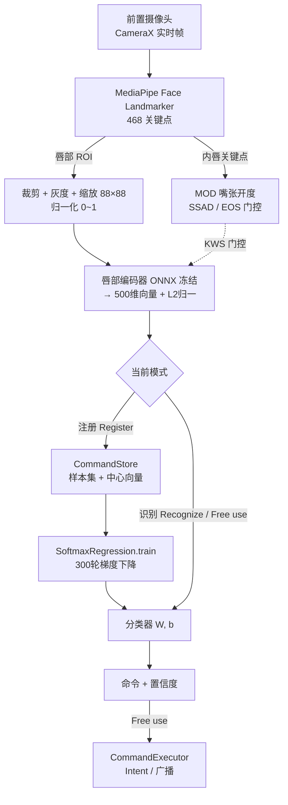
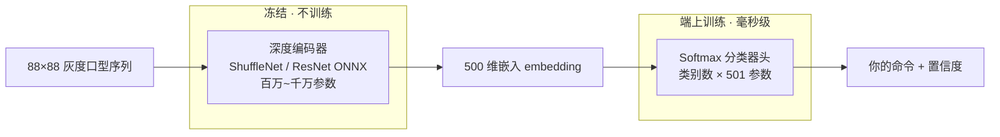
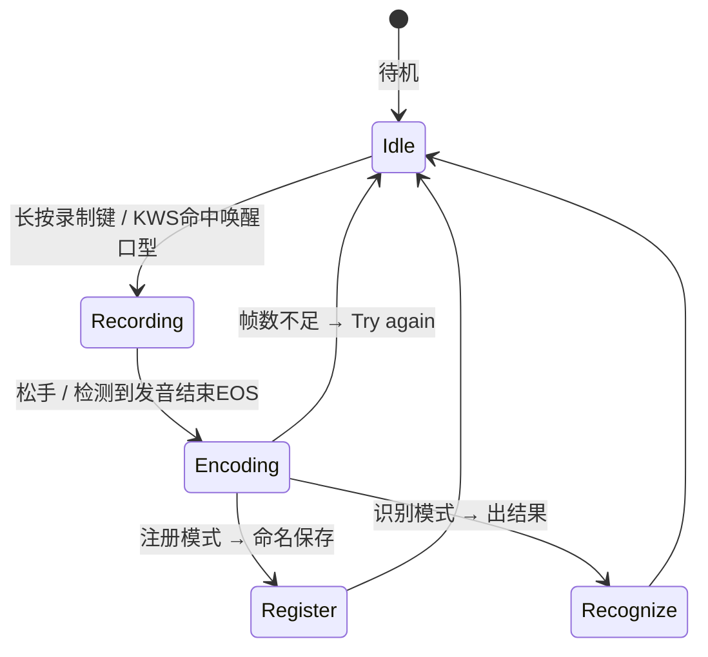

# LipLearner Android —— 技术原理与 Demo 操作指南

一个把 iOS 版 **LipLearner**(CHI 2023,无声唇语命令交互)移植到 Android 的可运行 App。
支持**多模型切换**、**端上少样本训练**、**免手唤醒(KWS)**,完全离线、在设备本地运行。

- 应用包名：`com.rkmtlab.liplearner`
- 已验证设备：nubia P0110（Android 16，arm64-v8a）
- 默认模型：`mpc001 ShuffleNet0.5x+TCN`（最轻,首启动最稳)

---

## 一、它是什么 / 能做什么

对着前置摄像头**用口型(可无声)说一句你自己注册过的命令**,App 实时识别出是哪条命令,并可触发对应动作。

核心特点(源于原论文):
1. **可定制**:命令是你自己注册的,任意语言、任意短语。
2. **少样本**:每条命令只需几个样本即可学会。
3. **端上、离线、实时**:识别与训练都在手机本地完成,不上传。

---

## 二、技术原理

### 2.1 整体管线

```
前置摄像头 (CameraX, 实时帧)
      │
      ▼
MediaPipe Face Landmarker  ──► 468 个人脸关键点
      │   • 由内唇关键点算 MOD(嘴张开度)→ 用于 KWS 门控/发音结束判定
      │   • 以唇为中心裁出正方形 ROI
      ▼
灰度化 + 缩放到 88×88,像素归一到 [0,1]   （右上角小窗就是这个裁剪画面）
      │
      ▼
唇部编码器 (ONNX Runtime, 冻结)  ──►  500 维特征向量(embedding),再做 L2 归一化
      │
      ├──【注册】把向量存进该命令的样本集,并更新“中心向量”
      │
      └──【识别】用轻量 Softmax 分类器判定是哪条命令(带置信度)
```

#### 架构图 1：系统总览



#### 架构图 2：冻结编码器 + 可训练分类器（少样本的关键)



#### 架构图 3：录制 / KWS 状态机



### 2.2 关键设计:冻结的编码器 + 轻量分类器(这是能“少样本”的原因)

| 组件 | 是否训练 | 参数量 | 作用 |
|---|---|---|---|
| **深度编码器**(ShuffleNet/ResNet 等,ONNX) | ❌ **永远冻结** | 数百万~数千万 | 把口型视频编码成一个**稳定、可区分**的 500 维向量 |
| **Softmax 分类器头**(`SoftmaxRegression`) | ✅ **端上训练** | `类别数 × 501` | 在冻结向量之上,拟合“向量 → 你的命令”的判别边界 |

- 编码器提供了一个通用的“唇语特征空间”,相似口型→相近向量。
- 你注册几条命令后,只需训练那个**几千个参数**的小分类器即可,毫秒级完成、无需在手机上反向传播大网络。
- 因此:**换命令 = 重训小分类器**,而不是重训大模型。

### 2.3 “点 Train 到底训练了什么”

`Save and Train` 会用**你所有已注册样本**,从零跑 **300 轮全批量梯度下降 + L2 正则**,拟合分类器的权重 `W[类别数×500]` 和偏置 `b[类别数]`。实测日志(真实设备):

```
epoch 0    loss=1.7918
epoch 100  loss=0.8638
epoch 200  loss=0.5418
epoch 299  loss=0.3878     → 6 类、31 样本、更新 3006 个参数
```

loss 单调下降即“梯度确实在更新参数”的直接证据。**更新的是小分类器,不是深度编码器。**

### 2.4 KWS(免手唤醒)与 SSAD

- **KWS**:开启后,以 30 帧滑窗持续编码,与“关键词中心向量”算相似度,超过阈值(默认 0.65)即自动开始录制(带震动反馈)。
- **发音结束(EOS)**:录制中与“非说话中心向量”相似度超阈值,即自动停止并识别。
- **SSAD**:仅当嘴张开(MOD ≥ 0.1)时才跑 KWS,降低发热/功耗(该优化未用于原论文用户研究)。

### 2.5 多模型架构

- 模型由 `ModelSpec` 描述(资源名、嵌入维度、是否定长、帧数等),`ModelRegistry` 列出**已内置的**模型,UI 里 **⋮ → Select model** 切换。
- 每个模型的命令数据**独立存储**(不同模型嵌入空间不同,不能混用),切换后各用各的。
- 预处理(灰度 [0,1])统一,**每个模型自己的归一化已固化进 ONNX 图**,所以切换模型不用改客户端。

### 2.6 iOS → Android 组件映射

| iOS | Android |
|---|---|
| CoreML `LipEncoder` | ONNX Runtime + `*.onnx`(`ml/LipEncoder.kt`) |
| Vision 人脸/唇部关键点 | MediaPipe Face Landmarker(`vision/LipLandmarker.kt`) |
| CreateML 逻辑回归(端上训练) | `ml/SoftmaxRegression.kt`(手写 Softmax 回归) |
| CSV/`.dat` 持久化 + 中心向量 | `ml/CommandStore.kt`(JSON,按模型隔离) |
| `SFSpeechRecognizer`(Voice2Lip) | `speech/SpeechRecognizerHelper.kt`(可选) |
| AVCaptureSession | CameraX(`camera/CameraController.kt`) |
| KWS/录制状态机 | `kws/LipRecognitionController.kt` |
| iOS Shortcuts 执行 | `exec/CommandExecutor.kt`(Intent/广播) |
| UIKit 控制器 | `ui/MainActivity.kt` |

---

## 三、内置模型

| 模型(⋮ 里可选) | 结构 | LRW 准确率 | 大小 | 输入 |
|---|---|---|---|---|
| `mpc001_snv05x_tcn1x` | ShuffleNetV2 0.5×+TCN | 79.9% | 12MB | 重采样到 29 帧 |
| `mpc001_snv1x_tcn1x` | ShuffleNetV2 1×+TCN | 82.7% | 15MB | 重采样到 29 帧 |
| `mpc001_snv1x_dsmstcn3x` | ShuffleNet1×+DS-MSTCN | 85.3% | 37MB | 重采样到 29 帧 |
| `mpc001_resnet18_mstcn` | ResNet18+MS-TCN | 88.9% | 145MB | 重采样到 29 帧 |
| `liplearner`(可选,需自行生成) | ResNet18+BiGRU(对比学习) | — | 120MB | 变长 10~128 帧 |

> 说明:mpc001 权重训练自 LRW 数据集,**仅限研究/非商用**。这些模型输出的 500 维在本 App 里被当作“嵌入向量”使用(靠你自己的样本做个性化),而非直接分类那 500 个英文词。

---

## 四、构建与安装

```bash
# 一次性:配置工具链环境(JDK17 + Android SDK)
source LipLearner_Android/scripts/android_env.sh

# 构建
cd LipLearner_Android
./gradlew :app:assembleDebug
# 产物:app/build/outputs/apk/debug/app-debug.apk  (arm64, ~242MB)

# 安装到手机(先开 USB 调试)
adb install -r app/build/outputs/apk/debug/app-debug.apk
```

首次启动请授予**相机**和**麦克风**权限。

---

## 五、Demo 详细操作步骤

### ⚠️ 先记住 3 个要点
1. **录制键是“长按”**:按住=录制,松开=结束。**每次按住 ≥1 秒**再松开(太短会提示 Try again,帧数不够)。
2. **注册时可出声、识别时不出声**:若手机有系统语音识别,注册时会自动填标签;**很多国产 ROM 没有识别服务(如本机),此时保存框是空的,手动输入命令名即可,不影响使用**。
3. **需先注册 ≥2 条不同命令并 Save and Train**,识别才可用。

### 界面速览
- 顶部:当前模型名;**右上角小窗 = 你的唇部裁剪画面**(用它确认嘴在框内)。
- 左上:⚙ 设置(语言)、⋮ 菜单(Save and Train / Reset keyword / **Select model**)。
- 底部:`Register / Recognize / Free use` 模式 → 录制模式(`Command/Keyword/Non speaking`,仅注册模式显示)→ 圆形录制键 → `KWS` 开关。

### 流程 A：最简闭环(注册 → 训练 → 识别)
1. 启动 → “Enter your name” → 填名字 → **New User**(全新;下次可 **Load Data** 载入)。
2. **Register** 模式,录制模式选 **Command**。
3. 对准嘴 → **按住**录制键 ≥1 秒,做“打开抖音”的口型 → 松开 → 弹 **Name this command** → 输入 `打开抖音` → **OK**,提示 `Registered`。
   - 建议**每条命令录 5~10 个样本**(重复本步,标签填一样)。
4. 同样注册第 2 条(如 `发送消息`)。
5. **⋮ → Save and Train**(训练分类器并保存)。
6. 切 **Recognize** 模式 → 按住做口型 → 松开 → 弹出预测 `Is "X" correct?`:
   - 对 → 可点 **Add sample** 把这次也加入(主动学习,越用越准);
   - 错 → 选正确标签加样本,或 Cancel。

### 流程 B：免手唤醒(KWS)
1. Register 模式 → **Keyword**:按住做你的唤醒口型 → 松开,重复 3~5 次。
2. → **Non speaking**:按住闭嘴静息几秒 → 松开,重复 3~5 次。
3. 再按流程 A 注册命令 → **Save and Train**。
4. 打开底部 **KWS** 开关。
5. 之后:做**唤醒口型**→ 自动录制(震动)→ 说完闭嘴 → 自动结束并识别。

### 流程 C：切换模型对比
- **⋮ → Select model** 选更强的模型(如 `mpc001_resnet18_mstcn`,88.9%)。
- 注意:**每个模型命令数据独立**,换模型后要**重新注册**它自己的命令。
- 第一次切到 ResNet(145MB)会拷贝到内部存储,**等几秒属正常**(不会崩)。

### 流程 D：Free use（自由使用)
- **Free use** 模式识别出命令后:**显示 + 发一条广播** `com.rkmtlab.liplearner.COMMAND`(extra `command`),可被 Tasker / MacroDroid / Automate 接住去执行动作。
- ⚠️ 目前**还没有“命令→具体动作(打开某 App)”的可视化映射界面**,所以现阶段 Free use 主要是“识别 + 广播”。

---

## 六、准确率经验（实测总结）

- **命令越少越准**:2 条时置信度常 0.9+;6 条且含相近词(如“调高音量/降低音量”)时会掉到 0.4~0.6。
- **别选唇形太像的命令**(尾字相同的一组尤其容易混)。
- **一致性**:既然靠手动/口型,注册和识别时的**口型、语速、举机角度**要尽量一致。
- **换更强模型 + 每条多录样本 + 用 Add sample** 是提升的三板斧。
- 性能参考:最轻模型编码延迟约 **40~60ms**(松手到出结果几乎无感)。

---

## 七、已知问题与修复记录（移植中踩过的坑)

| 现象 | 根因 | 处理 |
|---|---|---|
| 装上即闪退 | 用 `readBytes` 把 145MB 模型读进 Java 堆 → OOM | 改为**流式落盘 + ONNX 从文件路径 mmap**;默认用最轻模型;开 `largeHeap` |
| 一按录制键就弹保存框、无文字、注册不上 | 设备无系统语音识别,Voice2Lip 回调立即空触发 | 把保存框改到**松手后(向量已就绪)**触发,语音识别降级为可选 |
| 换模型后命令“消失” | 不同模型嵌入空间不同 | **按模型隔离**存储(设计如此,需各自重注册) |

---

## 八、局限

- mpc001 权重为 LRW 派生,**非商用**;要商用需在宽松许可数据上重训。
- mpc001 模型训练裁剪 ≠ 本 App 的 MediaPipe 裁剪,存在域差异;靠“你用同一管线注册自己的样本”来抵消,故个性化仍有效,但绝对准确率会与论文不同。
- 未移植:GIF 历史回顾、Free use 的命令→动作映射界面。
- APK 较大(~242MB,主要是 145MB 的 ResNet);可删除不用的 `.onnx` 或做 INT8/fp16 量化瘦身。

---

## 九、相关文件索引

- 编码器/推理:`app/src/main/java/com/rkmtlab/liplearner/ml/LipEncoder.kt`
- 端上分类器:`.../ml/SoftmaxRegression.kt`
- 模型注册表:`.../ml/ModelSpec.kt`
- 状态与持久化:`.../ml/CommandStore.kt`
- 唇部关键点:`.../vision/LipLandmarker.kt`
- 相机:`.../camera/CameraController.kt`
- 识别状态机/KWS:`.../kws/LipRecognitionController.kt`
- 主界面:`.../ui/MainActivity.kt`
- 模型导出脚本:`tools/export_mpc001_onnx.py`、`tools/export_onnx.py`
